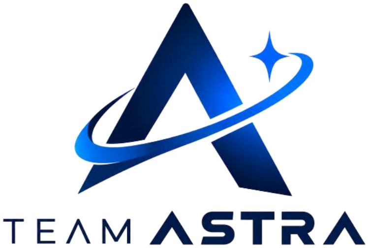

# ASTRA — learning continuity for rural and tribal students



**ASTRA keeps learning moving when connectivity stops.**

ASTRA is an offline-first learning continuity platform for rural and tribal students. It stores essential study material, progress and doubts on students' phones, so learning carries on through connectivity gaps. Saved answers and an optional local AI hub provide study support, while nearby content sharing and later synchronisation extend access. Trusted mentors offer doubt resolution and career counselling, with dedicated support for girls through education awareness and parent counselling.

This repository is a **frontend prototype**: a landing page plus a clickable demo with sign-in and dashboards for students, mentors and admins. It is plain HTML, CSS and JavaScript with no build step and no dependencies.

## What's inside

### Landing page (`index.html`)

An illustrated walkthrough of the platform:

| Section | What it shows |
|---|---|
| Home | Offline lessons, local AI, voice and sync at a community learning hub |
| Learning | The four-step continuity loop: download once, learn offline, ask locally, sync later |
| From learning to opportunity | How a weak topic leads to the right support and then a scholarship or career match |
| AI Tutor | Grounded answers in Hindi, English or a regional language from downloaded study material |
| Scholarships | Eligibility, document checklist and official application, saved offline |
| Mentors | Verified teachers, guest faculty, alumni and trained female mentors |
| Career Path | Discover → Prepare → Connect → Move forward |

All copy is real, selectable text laid over textless artwork, so it stays accessible and editable. On desktop each label is pinned to the artwork in image pixels, so it stays inside its painted card at any width. On tablets and phones the page switches to a stacked card layout.

### Sign in / sign up (`auth.html`)

Sign in or create an account as a **Student**, **Mentor** or **Admin**. The sign-up form adapts to the role:

- **Student:** class, preferred language, village or district, nearest learning hub
- **Mentor:** mentor type (including trained female mentor), subjects, languages and focus area. New mentors start as *unverified* until an admin approves them.
- **Admin:** organisation and an access code (`ASTRA-ADMIN` in the demo)

### Dashboards (`dashboard.html`)

| Role | Highlights |
|---|---|
| Student | Learning State Passport with the next best action, progress by subject, offline study packs with *share nearby*, saved answers, doubts that queue offline and send on sync, scholarships, career pathway, support for girls |
| Mentor | Doubt queue with in-place answers, availability, doubt / career / parent counselling sessions, girls' education awareness requests |
| Admin | Mentor verification (approve or reject), girls' programme metrics, hub sync status, content pack publishing, list of demo accounts |

Actions work end to end: a doubt a student asks shows up in the mentor's queue, and the mentor's answer shows up back on the student's dashboard.

## Try it

No install needed. Open `index.html` in a browser, or serve the folder:

```bash
npx serve .
# or
python -m http.server 8000
```

Then open **Sign in** and use a demo account (password `demo1234`), or click the one-tap demo buttons:

| Role | Email |
|---|---|
| Student | `student@astra.demo` |
| Mentor | `mentor@astra.demo` |
| Admin | `admin@astra.demo` |

**Reset demo** on the dashboard restores the sample data.

> **Prototype only.** Accounts and dashboard data are stored in the browser's `localStorage`, and passwords are not encrypted. There is no server. A production version would need a backend with real authentication.

## Project structure

```
index.html        Landing page
styles.css        Landing page layout (desktop overlays pinned to the artwork + mobile stack)
script.js         Navigation state, mobile menu, back-to-top
tokens.css        Shared design tokens: colours, type scale, spacing, radii, motion
auth.html/.js     Sign in / sign up with role selection
dashboard.html/.js  Student, mentor and admin dashboards
app.js            Demo data store, seeded accounts and session handling
app.css           Styles for the auth and dashboard pages
credits.html      Photo credits and licences
assets/           Textless artwork plates, photo composites and the Team ASTRA logo
```

## Design

- **Palette:** cream paper, navy ink, terracotta accent and teal, defined as OKLCH tokens in `tokens.css`
- **Type:** Inter / system sans for UI, Georgia for display headings
- **Accessibility:** semantic landmarks and headings, alt text on artwork, visible focus rings, 44px touch targets, and reduced-motion support

## Credits

Some section artwork includes photographs from Wikimedia Commons (CC BY-SA 2.0, CC BY-SA 3.0 and CC0). See [`credits.html`](credits.html) for authors and licences. The composited images `assets/opportunity-plate-boys.jpg` and `assets/scholarships-plate-boys.jpg` are shared under [CC BY-SA 4.0](https://creativecommons.org/licenses/by-sa/4.0/).

---

Built by **Team ASTRA** for rural and tribal learners · offline-first by design.
